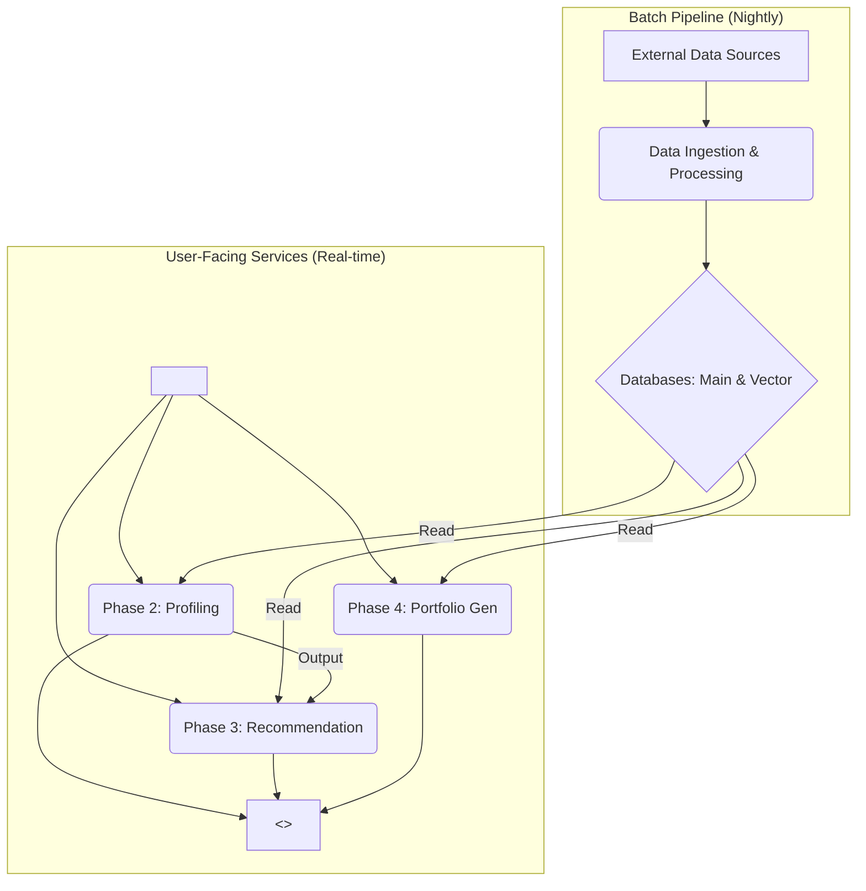

# 🚀 PRD: 스마트 로드 (Smart Road)

> 💡 **한 줄 요약:** 분산된 학생 데이터를 통합하고 AI로 분석하여, 개인 맞춤형 진로 로드맵 추천부터 원클릭 포트폴리오 생성까지 지원하는 KOREATECH 학생을 위한 지능형 학습·경력 관리 플랫폼

  - **상태:** 企画 (기획)
  - **PM:** Gemini
  - **작성일:** 2025년 10월 1일
  - **최종 수정일:** 2025년 10월 1일

-----

## 1\. 개요 (Overview)

### 1.1. 배경 및 문제 정의 🤔

현재 한국기술교육대학교(KOREATECH) 학생들은 자신의 학습 이력(성적, 비교과, 자격증, 수상 등)을 여러 시스템(아우누리, 학생종합경력개발 등)에서 파편적으로 관리하고 있습니다. 이로 인해 IPP나 취업 지원 시, 자신의 강점과 이력을 체계적으로 정리하고 증빙하는 데 많은 시간과 노력을 소요합니다. 또한, 목표 직무를 위해 어떤 활동과 과목을 이수해야 하는지에 대한 개인화된 가이드가 부재하여, 정보 탐색 과정에서 어려움을 겪고 있습니다.

### 1.2. 목표 🎯

  - **제품 목표:** 2026년 2분기까지 MVP를 출시하여, 재학생의 학습 및 경력 데이터 관리 시간을 **50% 단축**하고, IPP 지원서 작성의 편의성을 획기적으로 개선한다.
  - **사업 목표:** 플랫폼을 통해 축적된 비식별 데이터를 분석하여, 학교의 교육 과정 개선 및 학생 지원 정책 수립에 기여할 수 있는 인사이트를 제공한다.

### 1.3. 핵심 지표 (Metrics) 📊

  - **North Star Metric:** **주간 활성 사용자 수 (WAU)** - 얼마나 많은 학생이 지속적으로 자신의 경력 관리를 위해 플랫폼을 사용하는가?
  - **주요 성공 지표:**
    1.  **포트폴리오 생성률:** 월간 방문자 대비 포트폴리오 생성 완료 비율
    2.  **사용자 만족도 (CSAT):** "스마트 로드가 진로 준비에 도움이 되었나요?" 설문 점수
    3.  **기능 채택률:** 목표 직무(NCS) 설정 기능 사용 유저 비율

-----

## 2\. 사용자 (Users)

### 2.1. 타겟 사용자

  - **핵심 타겟:** 한국기술교육대학교 2\~4학년 재학생 (취업 및 IPP 준비에 대한 니즈가 가장 큰 그룹)
  - **확장 타겟:** 한국기술교육대학교 1학년 재학생 (조기 진로 탐색 및 설계)

### 2.2. 사용자 페르소나 🧑‍💻

\<details\>
\<summary\>👤 \<strong\>송재호 (3학년, 기계공학부) - "정리가 필요해\!"\</strong\>\</summary\>

  - **소개:** 다음 학기 IPP와 취업 준비를 시작하려는 3학년 학생. 여러 활동을 했지만, 어떤 것이 직무와 관련 있는지, 자기소개서에 어떻게 녹여내야 할지 막막하다.
  - **Goals:**
      - 흩어진 내 활동 내역을 한곳에 모아 관리하고 싶다.
      - 지원하려는 반도체 장비 직무에 맞춰 내 강점을 어필하는 포트폴리오를 만들고 싶다.
  - **Frustrations:**
      - 증명서, 성적표, 활동 내역을 매번 따로 찾아야 해서 번거롭다.
      - 내 스펙이 직무에 충분한지, 부족한 점은 무엇인지 객관적으로 알고 싶다.

\</details\>

\<details\>
\<summary\>👤 \<strong\>이예솔 (1학년, 산업경영학부) - "길을 알려줘\!"\</strong\>\</summary\>

  - **소개:** 학교 생활에 막 적응하기 시작한 신입생. 데이터 분석가라는 막연한 꿈은 있지만, 4년간 무엇을 어떻게 준비해야 할지 구체적인 계획이 없다.
  - **Goals:**
      - 내 목표를 위해 어떤 교내 활동, 대외활동, 자격증이 유리한지 추천받고 싶다.
      - 대학 생활을 체계적으로 계획하고 기록하고 싶다.
  - **Frustrations:**
      - 학교 홈페이지에 정보는 많지만 나에게 딱 맞는 정보를 찾기 어렵다.
      - 선배나 주변 동기들에게 의존해서 정보를 얻는 것이 불안하다.

\</details\>

-----

## 3\. 기능 명세 (Feature Specifications)

### 3.1. P1: 데이터 통합 대시보드 🖼️

> **Epic:** 사용자는 자신의 모든 학습 및 경력 데이터를 한 화면에서 직관적으로 파악하여, 현재 상태를 쉽게 진단하고 관리할 수 있다.

\<details\>
\<summary\>\<strong\>Feature 1.1: 원페이지 대시보드\</strong\>\</summary\>

  - **요구사항:**
      - 학점 변동 추이, 전공/교양 이수 현황 시각화 그래프
      - 최근 이수한 비교과/자격증/수상 내역 위젯
      - 핵심 역량(Phase 2 분석 기반) 요약 카드
      - 모든 데이터는 교내 DB와 연동하여 자동 업데이트

\</details\>

\<details\>
\<summary\>\<strong\>Feature 1.2: 데이터 자동 연동\</strong\>\</summary\>

  - **요구사항:**
      - **연동 대상:** 학사 DB(성적, 학적, 수강내역), 학생종합경력개발(비교과, 자격증, 수상)
      - **동기화 주기:** 매일 1회 야간 배치(Batch) 작업으로 동기화
      - **수동 입력:** 시스템에 없는 대외활동, 프로젝트, 경력은 사용자가 직접 입력/관리 가능

\</details\>

### 3.2. P2: AI 학습 진단 리포트 🩺

> **Epic:** 사용자는 데이터 기반의 객관적인 진단을 통해 자신의 학업적 강점과 약점을 파악하고, 잠재적 위험을 미리 인지하여 개선할 수 있다.

\<details\>
\<summary\>\<strong\>Feature 2.1: 강/약점 분석\</strong\>\</summary\>

  - **요구사항:**
      - 과목별 성적을 Z-score로 변환하여 상대적 성취도 분석
      - 강의계획서 기반 태그(예: 시험형, 과제형, 팀플형)와 Z-score를 결합하여 강점/약점 분야 도출
      - "당신은 [시험형] 과목에서 상위 15%의 강점을, [팀프로젝트형] 과목에서는 보완이 필요해요\!" 와 같은 직관적인 텍스트와 근거 데이터(카드 형태)를 시각적으로 제공

\</details\>

\<details\>
\<summary\>\<strong\>Feature 2.2: 학사경고 조기경보\</strong\>\</summary\>

  - **요구사항:**
      - 주요 피처(GPA 추세, F학점 비율 등) 기반의 예측 모델을 통해 학사경고 위험도 예측
      - 위험도를 `안정`, `주의`, `위험` 3단계로 구분하여 표시
      - `위험` 또는 `주의` 시, 예측에 가장 큰 영향을 미친 원인 Top 3와 함께 해결을 위한 교내 프로그램(튜터링, 상담센터 등) 링크를 함께 제공

\</details\>

### 3.3. P3: 맞춤형 성장 로드맵 추천 ✨

> **Epic:** 사용자는 자신의 진로 목표에 맞춰 부족한 역량을 채울 수 있는 최적의 교과/비교과 활동을 추천받아, 체계적으로 성장 계획을 수립할 수 있다.

\<details\>
\<summary\>\<strong\>Feature 3.1: NCS 기반 목표 설정\</strong\>\</summary\>

  - **요구사항:**
      - 사용자가 NCS 직무 분류(대-중-소-세) 체계에 따라 자신의 목표 직무를 설정하는 기능
      - 설정된 목표는 모든 추천 및 포트폴리오 생성의 기준점으로 활용됨

\</details\>

\<details\>
\<summary\>\<strong\>Feature 3.2: 역량 갭 분석 및 추천\</strong\>\</summary\>

  - **요구사항:**
      - 설정된 NCS 직무 기술서와 사용자의 이수 내역(교과, 비교과)을 임베딩 벡터 기반으로 비교하여 역량 갭(Gap) 분석
      - 분석된 갭을 채우기 위한 교내 비교과, 교과목, 외부 교육/공모전을 **유사도+인기+최신성**을 고려한 하이브리드 점수로 랭킹을 매겨 Top 5를 추천

\</details\>

### 3.4. P4: 원클릭 포트폴리오 생성 📄

> **Epic:** 사용자는 버튼 몇 번으로 시스템에 축적된 모든 데이터를 활용하여, 제출 목적에 최적화된 전문적인 포트폴리오를 즉시 생성할 수 있다.

\<details\>
\<summary\>\<strong\>Feature 4.1: 템플릿 선택 및 자동 완성\</strong\>\</summary\>

  - **요구사항:**
      - `IPP 지원서용`, `취업용 이력서`, `자유 양식` 등 다양한 템플릿 제공
      - 템플릿 선택 시, 설정된 목표 직무(NCS)와 가장 관련성 높은 데이터(과목, 프로젝트 등)를 우선적으로 자동 배치

\</details\>

\<details\>
\<summary\>\<strong\>Feature 4.2: 편집 및 내보내기\</strong\>\</summary\>

  - **요구사항:**
      - 자동 완성된 내용을 사용자가 자유롭게 수정, 추가, 삭제할 수 있는 편집 기능 제공
      - 외부 링크(GitHub, Notion, 블로그) 필드 추가 기능
      - 최종 완성된 포트폴리오는 PDF 파일 형식으로 다운로드 가능

\</details\>

-----

## 4\. 설계 및 기술 사양

### 4.1. 사용자 흐름 (User Flow)

`최초 접속` → `온보딩 (학사 데이터 연동 및 목표 설정)` → `대시보드 (현황 파악)` → `진단 리포트 (강/약점 확인)` → `추천 탭 (로드맵 설계)` → `포트폴리오 생성`

### 4.2. 와이어프레임 및 디자인

  - [Figma 링크 삽입 예정]

### 4.3. 기술 스택 (무료/오픈소스 중심 MVP 버전) 💰

> **핵심 원칙:** 초기 개발 및 테스트 단계에서 라이선스 및 호스팅 비용 발생을 최소화하기 위해 검증된 오픈소스 소프트웨어와 관대한 무료 플랜을 제공하는 서비스를 우선적으로 활용합니다.

  - **Backend:** **Python**, **FastAPI**

      - 빠르고 직관적인 개발이 가능한 현대적인 웹 프레임워크입니다. 라이선스 비용이 없습니다.

  - **Frontend:** **React**, **Next.js**

      - 강력한 UI 라이브러리와 서버사이드 렌더링을 지원하여 사용자 경험을 높입니다.

  - **Database:**

      - **Main DB:** **PostgreSQL**
          - 강력하고 안정적인 오픈소스 관계형 데이터베이스입니다.
      - **Vector DB:** **pgvector**
          - **[비용 절감 핵심]** Pinecone 대신 사용하는 PostgreSQL 확장 프로그램입니다. **별도의 벡터 DB를 구축할 필요 없이, 기존 PostgreSQL 내에서 벡터 검색을 구현**할 수 있어 아키텍처가 매우 단순해지고 비용이 획기적으로 절감됩니다.

  - **ML / NLP:** **Scikit-learn**, **KLUE-BERT (Hugging Face)**, **PyTorch**

      - 모두 오픈소스로, 모델 개발 및 서빙에 라이선스 비용이 들지 않습니다.

  - **Infra & Deployment (배포):**

      - **🥇 옵션 A: PaaS 무료 플랜 조합 (가장 추천)**

          - **Frontend:** **Vercel** 또는 **Netlify** (개인 프로젝트용 무료 플랜)
          - **Backend:** **Render** 또는 **Fly.io** (Docker 컨테이너 무료 배포)
          - **Database:** **Supabase** 또는 **Render** (무료 PostgreSQL 제공, Supabase는 pgvector 기본 지원)

      - **🥈 옵션 B: 클라우드 프리 티어 (Free Tier) 활용**

          - **Provider:** **AWS Free Tier** 또는 **GCP Free Tier**
          - **구성:** EC2(t2.micro), RDS(Free Tier), S3(Free Tier) 등을 조합하여 12개월간 무료로 운영 가능합니다.
          - ⚠️ **주의:** 기간이나 사용량 초과 시 비용이 발생하므로, 지속적인 모니터링이 필수적입니다.

      - **🥉 옵션 C: 자체 호스팅 (Self-Hosting)**

          - **대상:** 학교 연구실 서버나 사용하지 않는 개인 PC가 있을 경우
          - **구성:** **Docker**, **Docker Compose**를 사용하여 모든 스택을 직접 서버에 설치하고 운영합니다.
          - **장단점:** 금전적 비용은 없지만, 서버 설정, 보안, 유지보수에 직접적인 노력이 필요합니다.

### 4.4. 알고리즘 구조도

-----

## 5\. 출시 계획 (Launch Plan)

### 5.1. 로드맵

  - **Phase 1 (MVP, \~2026.Q2):**
      - **핵심 기능:** 데이터 통합 대시보드(P1), 원클릭 포트폴리오 생성(P4)
      - **목표:** 데이터 취합 및 정리라는 가장 큰 고통점(Pain Point)을 먼저 해결한다.
  - **Phase 2 (\~2026.Q3):**
      - **확장 기능:** AI 학습 진단 리포트(P2) 출시
      - **목표:** 객관적인 자기 분석 기능을 제공하여 플랫폼의 가치를 높인다.
  - **Phase 3 (\~2026.Q4):**
      - **고도화 기능:** 맞춤형 성장 로드맵 추천(P3) 출시
      - **목표:** 단순한 '기록'을 넘어 '설계'를 돕는 지능형 파트너로 진화한다.

### 5.2. 미포함 기능 (Future Scope)

  - 모바일 앱 개발
  - 학생 간 커뮤니티 및 소셜 기능
  - 기업 채용 공고 직접 연동